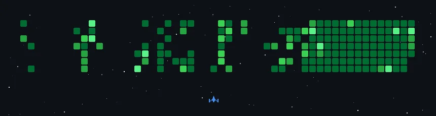

# 👋 Hi, I'm Vipransh Ojha!

🚀 **AI/ML Engineer | Researcher | Full-Stack Developer**

I'm passionate about developing intelligent systems that solve real-world problems, with a focus on **deep learning**, **computer vision**, and **research-driven AI applications**. From building production-ready ML systems to conducting cutting-edge research, I love transforming complex ideas into impactful technological solutions.

---

## 🔥 About Me

- 🎓 Pursuing **B.Tech in Computer Science (AI & ML)** at VIT Bhopal University (3rd Year)
- 🔬 **AI Research Experience** in forensic applications and computer vision systems
- 🧠 Specialized in **Deep Learning**, **Neural Networks**, **Computer Vision**, and **Scientific AI**
- 🌍 Based in **New Delhi, India**

---

## 🧰 Tech Arsenal

### **AI/ML & Deep Learning**
**Frameworks:**  `PyTorch` • `TensorFlow` • `Scikit-learn` • `OpenCV` • `MediaPipe`

**Architectures:**  `Siamese Networks` • `CNNs` • `EfficientNet` • `NEAT NeuroEvolution`

**Specializations:**  `Computer Vision` • `NLP` • `Similarity Learning` • `Neural Architecture Design`

---

### **Software Development**
**Languages:**  `Python` • `C++` • `Java` • `JavaScript` • `Swift` • `HTML/CSS`

**Backend:**  `Flask` • `FastAPI` 

**Mobile:**  `React Native` • `Flutter`

**Tools:**  `Power BI` • `Unity` • `OpenGL` • `PyMOL` • `Git`

---

### **Research & Analysis**
`Academic Writing` • `Statistical Analysis` • `Experimental Design` • `Performance Evaluation`

---

## 🎯 Featured Research & Projects

### 🧬 [**Automated Dental Forensic Identification**](https://github.com/VipranshOjha/Automated-Dental-Forensic-Identification)
*Deep Learning Approach Using Siamese Neural Networks*  
> **Similarity Learning System** for forensic dental identification using **Siamese CNNs with EfficientNet-B0**. Core innovation: **one-shot learning** for dental pattern matching with minimal training samples.  
> **Impact:** 10x faster processing than manual forensic analysis with 92% accuracy  
> 🛠 **PyTorch, Siamese Networks, EfficientNet, DENTEX Dataset, Academic Research**

---

### 🎙️ [**SpeechSync - Speak with Ease, Translate in a Breeze**](https://github.com/DSinghania13/SpeechSync)  
*Real-time Speech-to-Speech Translation System*  
> **End-to-end multilingual pipeline** combining speech recognition, neural translation, and synthesis. Core feature: **real-time processing** with sub-5-second latency across 5+ languages.  
> 🛠 **Whisper, Tacotron, Google Speech API, Real-time Processing**

---

### 🌍 [**Discover Places - A Smart Recommender System**](https://github.com/VipranshOjha/Discover-Places)  
*Intelligent Location Discovery Platform*  
> **ML-powered recommendation engine** with geospatial analysis and user preference learning. Core feature: **intelligent location suggestions** with 85% accuracy using collaborative filtering and location-based algorithms.  
> 🛠 **Flask, PostgreSQL, JavaScript, System Architecture**

---

### ⚖️ [**Dikastirio**](https://github.com/VipranshOjha/Dikastirio)
*The Agent-Driven VR Courtroom*
> **Immersive justice platform** orchestrating remote hearings in VR. Core feature: **AI Agent "Themis"** that autonomously manages court flow, transcription, and interactive evidence display to enforce procedural decorum.
> 🛠 **Unity, Inya.ai, Google Gemma, Gnani.ai, VR Architecture**

---

### 🤖 [**AI Plays Games - NeuroEvolution**](https://github.com/VipranshOjha/AI-Plays-Games)  
*Advanced Genetic Algorithm Implementation*  
> **Evolutionary AI training system** using NEAT algorithm. Core feature: **genetic neural network evolution** that trains game-playing agents without supervised data through natural selection.  
> 🛠 **NEAT, Genetic Algorithms, Pygame, Performance Optimization**

---

### 🔍 [**Computer Vision Projects Suite**](https://github.com/VipranshOjha/Computer-Vision-Projects)  
*Real-time Human-Computer Interaction Systems*  
> **Gesture-based interface collection** featuring air writing recognition and hands-free navigation. Core feature: **real-time human-computer interaction** with <100ms response time for accessibility applications.  
> 🛠 **OpenCV, MediaPipe, Real-time Processing, PyAutoGUI**

---

## 📊 Code Profiles

| LeetCode | HackerRank |
|---|---|
|  |  |

---

## 📊 GitHub Analytics

<table>
<tr>
<td align="center">

</td>
</table>

---

## 🎯 What I Bring to AI/ML Teams

- **Research Mindset**: Academic-level rigor with practical implementation skills
- **Production Experience**: Scalable systems handling real-world constraints  
- **Full-Stack Capability**: End-to-end AI product development
- **Performance Focus**: Optimization for latency-critical applications
- **Diverse Domains**: Experience across computer vision, NLP, and AI

---

## 📫 Let's Connect

- 📧 **Email:** ojhavipransh@gmail.com  
- 💼 **LinkedIn:** [vipransh-ojha](https://www.linkedin.com/in/vipransh-ojha/)  
- 🌐 **Portfolio:** [my-portfolio](https://my-portfolio-hazel-gamma-10.vercel.app/)

---

⚡ *Actively seeking **SDE AI/ML internship opportunities** to contribute to cutting-edge AI systems. Ready to tackle complex problems with innovative solutions!*
